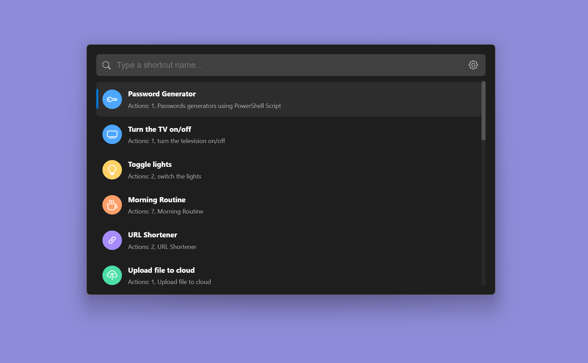
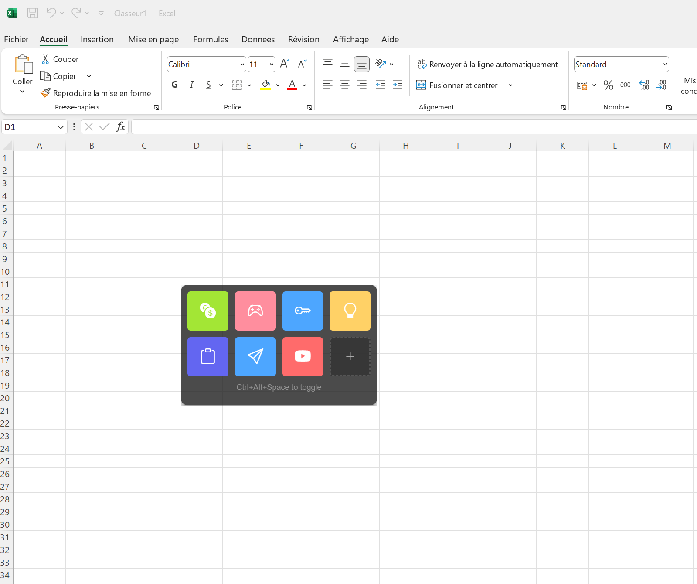

#  PC Shortcuts Manager

**Automate Windows workflows with powerful, multi-action shortcuts!**  

An **open-source Electron.js** app that lets you create flexible shortcuts with **one or multiple actions**—triggerable via hotkeys, widgets, HTTP requests, and more. Perfect for power users and automation lovers!  

---

## Screenshots Gallery

<a href="./screenshots/homepage.png" target="_blank">
  
</a>

<div style="display: flex; justify-content: center; gap: 10px; margin-bottom: 20px; flex-wrap: wrap;">
  <a href="./screenshots/homepage.png" onclick="event.preventDefault(); document.getElementById('main-screenshot').src='./screenshots/homepage.png'; document.querySelectorAll('.thumbnail-img').forEach(img => img.style.borderColor='#ddd'); this.querySelector('img').style.borderColor='#4CAF50'">
    
  </a>
  <a href="./screenshots/spotlight.png" onclick="event.preventDefault(); document.getElementById('main-screenshot').src='./screenshots/spotlight.png'; document.querySelectorAll('.thumbnail-img').forEach(img => img.style.borderColor='#ddd'); this.querySelector('img').style.borderColor='#4CAF50'">
    
  </a>
  <a href="./screenshots/builder.png" onclick="event.preventDefault(); document.getElementById('main-screenshot').src='./screenshots/builder.png'; document.querySelectorAll('.thumbnail-img').forEach(img => img.style.borderColor='#ddd'); this.querySelector('img').style.borderColor='#4CAF50'">
    
  </a>
  <a href="./screenshots/widget.png" onclick="event.preventDefault(); document.getElementById('main-screenshot').src='./screenshots/widget.png'; document.querySelectorAll('.thumbnail-img').forEach(img => img.style.borderColor='#ddd'); this.querySelector('img').style.borderColor='#4CAF50'">
    
  </a>
  <a href="./screenshots/widget2.png" onclick="event.preventDefault(); document.getElementById('main-screenshot').src='./screenshots/widget2.png'; document.querySelectorAll('.thumbnail-img').forEach(img => img.style.borderColor='#ddd'); this.querySelector('img').style.borderColor='#4CAF50'">
    
  </a>
  <a href="./screenshots/settings.png" onclick="event.preventDefault(); document.getElementById('main-screenshot').src='./screenshots/settings.png'; document.querySelectorAll('.thumbnail-img').forEach(img => img.style.borderColor='#ddd'); this.querySelector('img').style.borderColor='#4CAF50'">
    
  </a>
</div>

---

## ✨ Features

### 🔥 Multi-Action Shortcuts  
- Chain **Powershell scripts, keystrokes, OCR, file operations** into a single shortcut  
- Built-in **powerful actions** (OCR, script execution, keystroke emulation)  

### 🚀 Multiple Trigger Methods  
- **Hotkeys** (global/system-wide)  
- **App Window** (GUI dashboard)  
- **Spotlight-like Quick-Launch** (search & run instantly)  
- **HTTP Request Trigger** (integrate with other apps/platforms)  
- **Desktop Widget Buttons** (one-click access)  

### 📂 Organization & Portability  
- **Import/Export** shortcuts for backup or sharing  
- **Folder Organizers** to categorize shortcuts  

### 🔗 Easy Integration  
- **HTTP API** to trigger from other apps (Slack, mobile, webhooks)  
- **Powershell-native** for advanced scripting  

---

## 🛠 Tech Stack  
- **Electron.js** (cross-platform UI)  
- **Powershell** (backend automation)  

---

## 📋 Requirements  
- **OS**: Windows 10/11  
- **Powershell 5.1+** (preinstalled)  
- **RAM**: 4 GB (recommended)  
- **Storage**: 1 GB free  

---

## 🚀 Why Use This?  
- Replace repetitive tasks with **one-click automation**  
- **No coding needed** for basic shortcuts  
- **Lightweight** compared to bloated tools  

---

## 📥 Installation  

### End Users
1. Download from [Releases](#)
2. Run installer
3. Launch and create shortcuts!

### Developers
```bash
git clone https://github.com/hassananayi/pc-shortcuts-manager.git
cd pc-shortcuts-manager
npm install
npm start
```

---

## 📜 License (MIT)

**Permissions** ✅  
- Use commercially  
- Modify and redistribute  
- Include in proprietary software  

**Limitations** ⚠️  
- No liability/warranty  
- Must include original license  

---

<small>✨ Tip: Click thumbnails to view different screenshots!</small>


